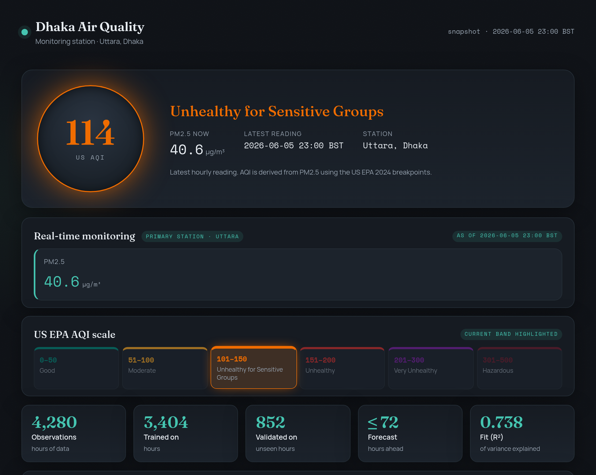
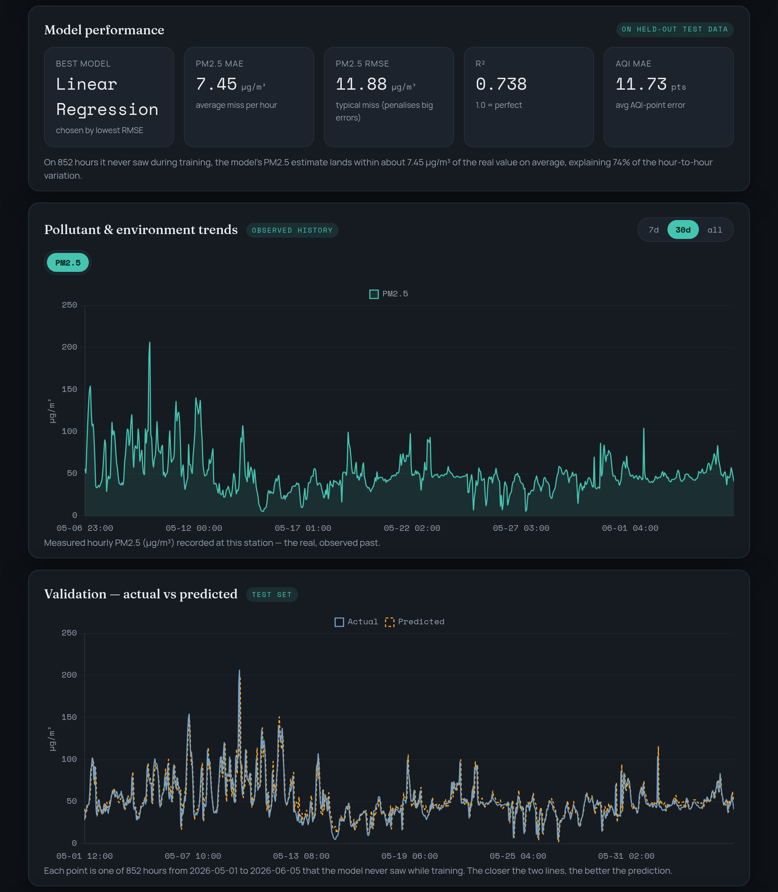
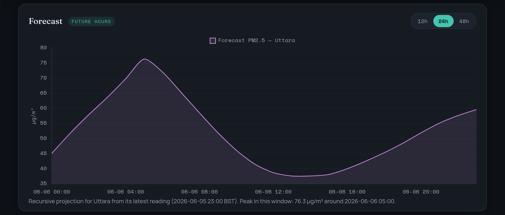
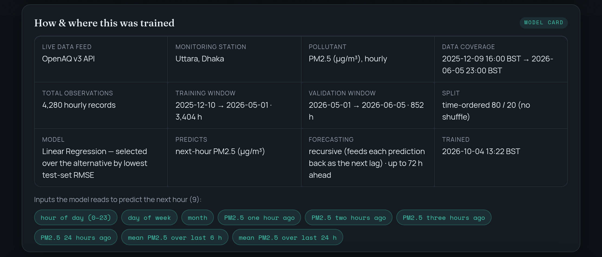
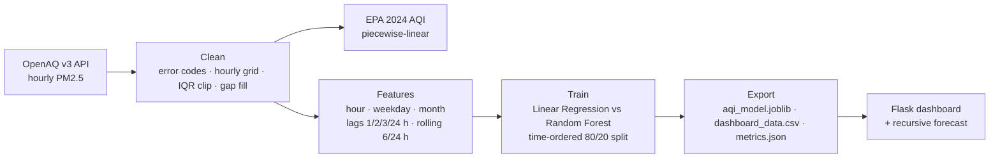

<div align="center">


# Dhaka Air Quality: Monitoring & Prediction

**An end-to-end air-quality project for Dhaka.** It pulls PM2.5 readings from public monitoring stations through the OpenAQ v3 API, converts them to the US EPA 2024 AQI, trains a next-hour forecasting model, and serves everything in a live web dashboard.

[](https://github.com/happinessisreal/dhaka-aqi-dashboard/actions/workflows/ci.yml)
[](requirements.txt)
[](app.py)
[](AQI_Prediction_Model.ipynb)
[](static/app.js)
[](https://openaq.org)
[](LICENSE)



</div>

## ✨ Features

- **Current AQI at a glance.** A large colour-coded indicator for the latest reading, plus the full US EPA 2024 scale with the current band highlighted.
- **Next-hour PM2.5 model.** Trained on 4,280 hourly observations using a time-ordered 80/20 split with no shuffling. On 852 unseen hours it scores **R² 0.74** and **MAE 7.45 µg/m³**.
- **Forecast up to 72 h.** The model is rolled forward recursively, feeding each prediction back in as the next lag.
- **Live mode.** With an OpenAQ key, the hero card and city map read the *current* value from OpenAQ through a stale-while-revalidate background cache. Without a key, the app falls back to the bundled snapshot.
- **City sensor network** (optional). Covers 8 stations across Dhaka (Uttara, Gulshan, Baridhara, Badda, Mirpur, Moghbazar, Dhanmondi, Hazaribagh). Every pollutant each station reports is shown, and each station's AQI comes from its dominant pollutant, following the EPA rule.
- **Reproducible notebook.** [`AQI_Prediction_Model.ipynb`](AQI_Prediction_Model.ipynb) runs fully offline on the bundled dataset and is committed with its outputs and plots.

## 📸 Screenshots

| Model performance, observed trends and held-out validation | Recursive forecast |
|:--:|:--:|
|  | <br><br> |

## 🚀 Quick start

```bash
git clone https://github.com/happinessisreal/dhaka-aqi-dashboard.git
cd dhaka-aqi-dashboard
python -m venv .venv && source .venv/bin/activate   # Windows: .venv\Scripts\activate
pip install -r requirements.txt
python app.py                                        # → http://127.0.0.1:5000
```

That's all you need. The trained model and dashboard data are committed, so a fresh clone runs offline.

### Turn on live data (optional)

Get a free API key at [explore.openaq.org](https://explore.openaq.org), then:

```bash
export OPENAQ_API_KEY=your_key
python gen_network.py   # builds network.json, which enables the city map and area comparison
python app.py
```

| Variable | Default | Purpose |
|---|---|---|
| `OPENAQ_API_KEY` | *(unset)* | Enables live readings and the data-refresh scripts. When unset, the bundled snapshot is served |
| `AQI_LIVE` | `1` | Set to `0` to force snapshot mode even if a key is present |
| `AQI_LIVE_TTL` | `600` | Live cache lifetime, in seconds |
| `AQI_LIVE_TIMEOUT` | `12` | OpenAQ request timeout, in seconds |
| `AQI_DATA_DIR` | repo root | Folder to read the exported model/data files from |

## 🧠 How the model works



| Model (held-out test set, 852 h) | PM2.5 MAE | PM2.5 RMSE | R² | AQI MAE |
|---|---:|---:|---:|---:|
| **Linear Regression** *(selected, lowest RMSE)* | 7.45 µg/m³ | 11.88 µg/m³ | 0.738 | 11.73 |

AQI is a deterministic function of PM2.5 (the [EPA 2024 breakpoints](https://www.epa.gov/aqi)), so the model predicts PM2.5 and the AQI is derived from it. The model is a short-horizon nowcaster. It is strongest in the first few hours and is not a substitute for a weather-driven multi-day forecast.

## 🔌 API

The dashboard is a thin client over a small JSON API.

| Endpoint | Description |
|---|---|
| `GET /api/summary` | Current AQI, category, PM2.5 and per-channel readings (live, or snapshot) |
| `GET /api/meta` | Model card: data coverage, split, features, station |
| `GET /api/history?days=30` | Observed hourly history for the last N days (the UI uses 7, 30 and 365) |
| `GET /api/predictions` | Actual vs predicted values on the held-out test set |
| `GET /api/forecast?hours=24&area=` | Recursive forecast (max 72 h), optionally for a network area |
| `GET /api/network` | Multi-station snapshot (needs `network.json`) |

## 🗂️ Project structure

```
├── app.py                      Flask backend and JSON API
├── live.py                     OpenAQ v3 client: stale-while-revalidate cache, EPA sub-indices
├── AQI_Prediction_Model.ipynb  Data download → cleaning → features → training → export
├── gen_network.py              Builds network.json (multi-station, multi-pollutant snapshot)
├── gen_model_card.py           Builds model_card.json (provenance shown on the dashboard)
├── add_pollutants.py           Adds the station's other real channels (PM1, temperature, humidity)
├── dataset/training_data.csv   Bundled hourly PM2.5 history, so the notebook runs offline
├── aqi_model.joblib, dashboard_data.csv, predictions_actual_vs_predicted.csv,
│   metrics.json, model_card.json      ← committed notebook exports the app reads
├── templates/, static/         Dashboard UI (Chart.js + Leaflet)
└── tests/                      pytest: AQI maths and offline API smoke tests
```

## 🔁 Retrain / refresh data

```bash
jupyter nbconvert --to notebook --execute --inplace AQI_Prediction_Model.ipynb   # offline by default
OPENAQ_API_KEY=... jupyter nbconvert --to notebook --execute --inplace AQI_Prediction_Model.ipynb  # fresh download
python gen_model_card.py 6157905     # 6157905 = the Uttara station the model is trained on
```

The app hot-reloads the exported files when they change on disk, so you don't need to restart it.

## 🧪 Tests

```bash
pip install pytest && pytest -q
```

## ⚠️ Notes

- `python app.py` runs Flask's development server. It's fine for demos. For a public deployment, put it behind a WSGI server such as `gunicorn app:app`.
- Data comes from low-cost public monitors through OpenAQ. These report particulates and environment channels only. To add true gas readings (NO₂/SO₂/O₃/CO), add reference-station location IDs to `NODES` in `gen_network.py` and `live.py`. The AQI maths already handles them.

## 📄 License

[MIT](LICENSE). Air-quality data © its respective providers, distributed by [OpenAQ](https://openaq.org) under their terms.
